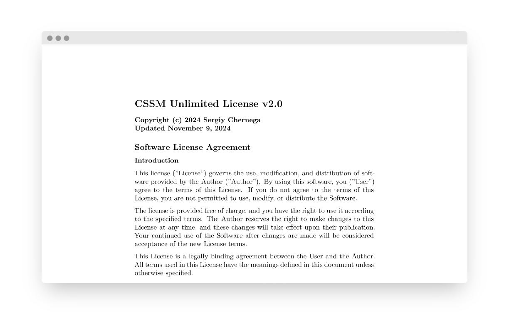

# CSSM Unlimited License Specification

This repository contains the official texts, specification, adoption guidelines, and templates for the CSSM Unlimited License family.

## License Versions

- [CSSM Unlimited License v2.0](./LICENSE-2.0.txt) (current, 2024-11-09)
- [CSSM Unlimited License v1.0](./LICENSE-1.0.txt) (2019-12-15, archived)

## How to Use

- Choose the license version you want to apply.
- Copy `LICENSE-2.0.txt` or `LICENSE-1.0.txt` to your project root as `LICENSE`.
- Replace `[YEAR]` and `[AUTHOR NAME]` in the header.
- Add a link to this repository or [cssmp.pp.ua](https://cssmp.pp.ua).

## Documentation

- [CHANGELOG.md](./CHANGELOG.md): License change history.
- [CONTRIBUTING.md](./CONTRIBUTING.md): Contribution guidelines.
- [ADOPTION.md](./ADOPTION.md): How to adopt CSSM Unlimited License in your project.
- [FAQ.md](./FAQ.md): Common questions answered.
- [examples/](./examples): Practical templates for headers and README.

## Links

- GitHub CSSM Group: [Fyennyi](https://github.com/Fyennyi)
- Website: [cssmp.pp.ua](https://cssmp.pp.ua)
